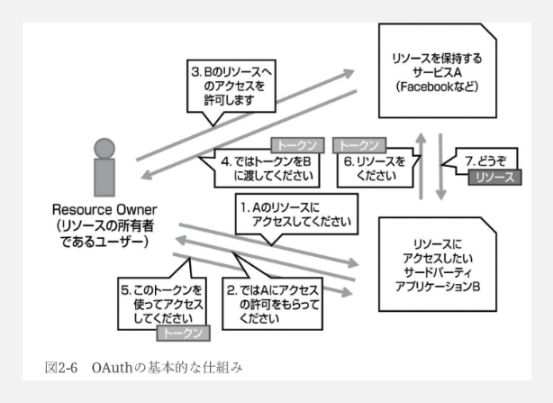
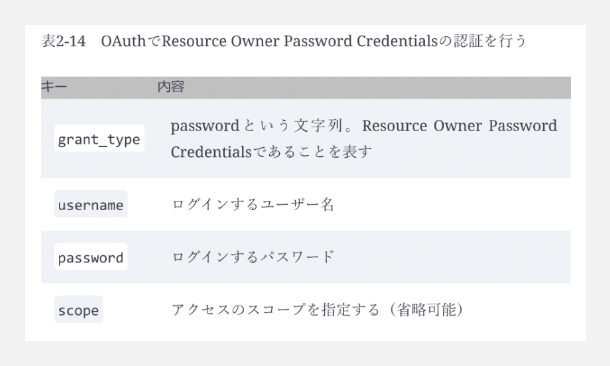
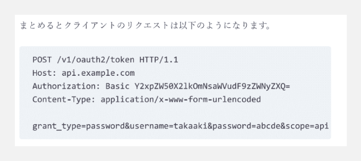
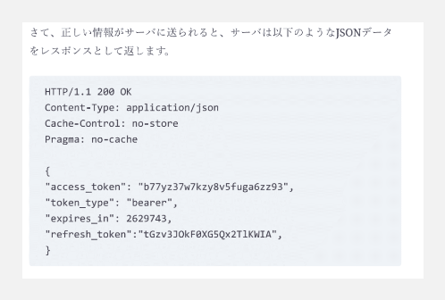
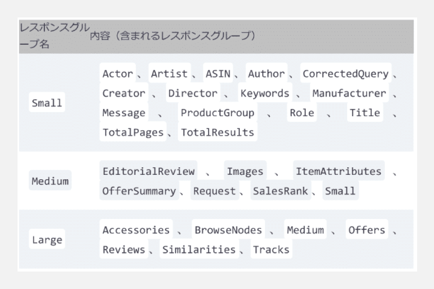
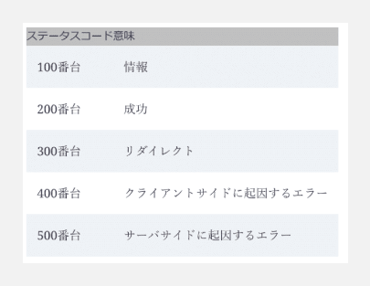

### WebAPIとはなにか

**なぜWebAPIの設計を議論するのか？**

* 様々な付加価値を企業や個人が提供してくれたり、自分は思いついたけど優先順位を下げていたサービス、そもそも思いつかなかったサービスなどを開発してくれるかも
> ツイッターはシンプルな140文字ツイートシステムから、API公開によってデータ分析等の周辺システムの開発が進み、巨大なエコシステムへ

* 社内システムの連携において、WebAPIを利用して疎結合に
* 設計を美しくすることで、利用者にとって使いやすく、かつ影響が少なくなる

**WebAPIを美しくするための2つ**

1. 仕様が決まっているものは仕様に従う
2. 仕様が存在していないものはデファクトスタンダードに従う
> デファクトスタンダードは、API公開し利用してもらい、たくさんのフィードバックをもらうことで一般化されている

---

### エンドポイントの設計とリクエストの形式

**URIの設計**

1. 短く入力しやすい
2. 人間が読んで理解できる
3. 大文字小文字が混在していない
4. 改造しやすい（バージョン管理など）
5. サーバ側のアーキテクチャが反映されていない
> ```get_user.php?user=100```のようになっていると、アーキテクチャの特定を容易にしてしまい、攻撃を受ける可能性がある。phpの特定のバージョンで脆弱性が発表されたら？
6. ルールが統一されている

**URIの例**

* 特定ユーザの近況の取得：GET ```users/:id/updates```
* 友達の近況一覧の取得：GET ```users/:id/friends/updates```

**注意点**

* 一覧系は複数系で伝わるし、URIも長くなるのでlistは不要
* 単語を繋げる場合はハイフンを利用
> Googleがハイフンを推奨。Webではリンクに下線が引かれることがあるのでアンダースコアは見にくい場合がある

**検索とクエリパラメータ**

* 1ページ50アイテム存在していた場合で、101アイテム目から取得するとき
* ```per_page=50&page=3```や、```limit=50&offset=100```
> ※```limit```と```offset```の方が自由度が高い
* URIにsearchという単語を含めるのはアリ。「一覧の取れないけど検索のAPIは提供しますよ」が伝わる。

**OAuth**






---

### レスポンスデータの設計

**データの内部構造**

* APIのアクセス回数が増えると利用者にとって使いづらい上に、HTTPのオーバーヘッドも上がってアプリ速度が低下する。また、サーバ側の負荷も上がってしまう

* ただ、全てのデータがいらないタイミングで大きなデータを送信することは避けたい。```users/12345?fields=name,age```のようにフィールドを指定したり、Amazonでは「レスポンスグループ」で対応していたりする。




* データ構造はなるべくフラット（送信者と受信者のように、属性が共通しそうなものは階層化したほうがいい場合もある）

> Googleのスタイルガイドにも「なるべくフラットにすべきだけど階層化したほうが絶対にいい場合は階層化はあり」と記述（https://google.github.io/styleguide/jsoncstyleguide.xml#Flat_vs.Nested）
> 階層化は、「データサイズの増加」、「クライアント側のコードが深くなる」

* レスポンスはオブジェクトで包む（配列だとJSONインジェクションという脆弱性に対するリスクが大きくなる）

**データのフォーマット**

* 単語の連結方法は統一
> JavaScriptはキャメルケースが相性がいいことから、Googleのスタイルガイドでもキャメルケース推奨。ただ、スネークケースは視認性が高く、結局は統一することが重要
* IDなどの巨大な数値を扱う場合、ビット数的に誤差が出る可能性があるため、文字列として返す
* 日付はRFC 3339がデファクトスタンダード

**ステータスコード**



**キャッシュとHTTPの仕様**

**メディアタイプの指定**

**同一生成元ポリシー**


---

