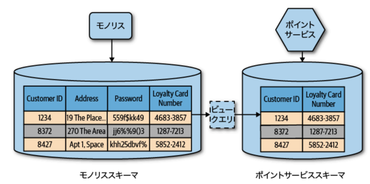
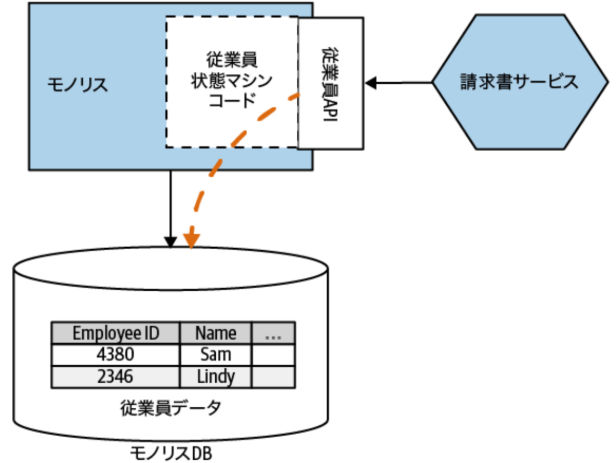
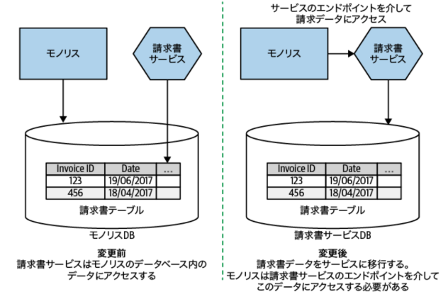
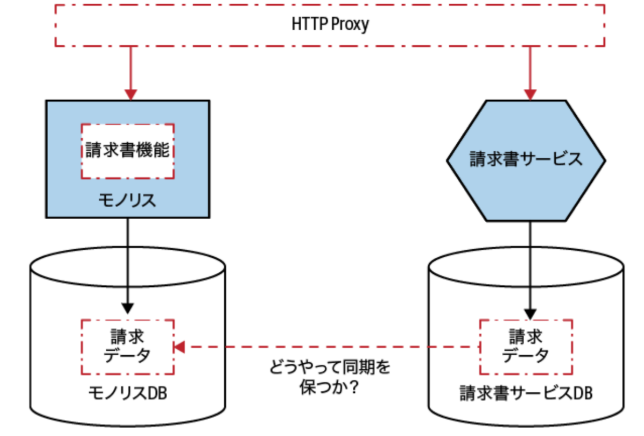
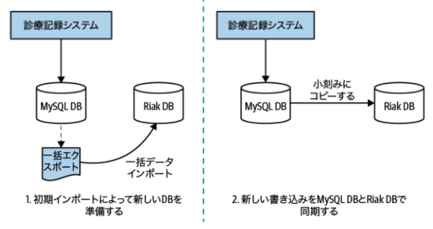
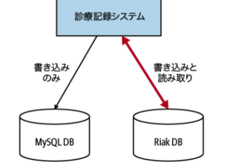
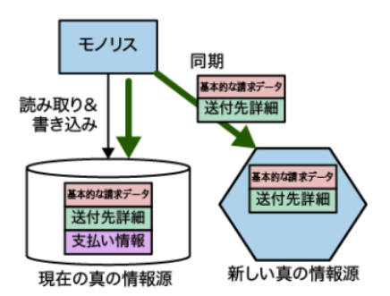
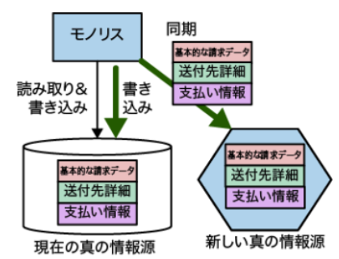

### １．共有データベース
**課題**

* 情報隠蔽に反する。どの部分を安全に変更できるかを理解するのが難しくなる。
* データの管理者が不明瞭になる（誰がデータの変更に責任を持つのか）
* ビジネスロジックの凝集度が欠如する。データを操作するビジネスロジッがシステム全体に散らばる。探せなくなる。

**解決策**

* 解決策としては、「データベースビュー」か、「データベースをラップするサービス」

**共有データベースの使いどころ**

1. 読み取り専用に静的参照データを考える場合。データ構造が安定しているスキーマ。

* 国の通貨コード情報や郵便番号の参照テーブル。

> 車の販売領域であれば、メーカーから与えられるマスターデータや、全国販売店共通の参照データ。

2. 複数のコンシューマーが使用する目的で設計・管理された定義済みエンドポイントとして、サービスがデータベースを直接公開している場合。

* 「サービスのインタフェースとしてのデータベース」で詳しく解説

---

### ２－１．データベースビュー

**What**

* 外部システム向け公開用、読み取り専用のDB
* 情報隠蔽（カプセル化）が可能





> 車の販売領域の場合、注文テーブルに、注文情報だけでなく下取車の情報や登録情報が混在しており、さらにシステム内部構造データが含まれている。ビューは、注文テーブルから注文情報だけを提供するようなクエリにより、情報隠蔽を実現している。

**How**

* RDBで一般的な機能（多くのデータベースエンジンがビューをサポートしている）
* クエリの結果から生成

**When**

* 既存のモノリシックスキーマを分解することが現実的ではないとき

> データ構造やデータ型はモノリスに引っ張られる。最終形態（マイクロサービス）へ向かうための過渡期における踏み台に過ぎない

---

### ２－２．データベースをラップするサービス

1. App Aや、App B等、色々なアプリケーションから権限データを更新・参照ができる状態になっている
2. 既存データを操作できる新しい「権限サービス」というバックエンドを構築し、それぞれのアプリケーションの向き先を「権限サービス」に移行してもらう

> * DBの直接アクセスを禁止するため、従来のアプリが必要としていたデータをAPIですべて肩代わりしなければならない。必然的にAPIの構造は「DBのテーブル構成」や「既存のロジック」に強く引きずられたものになりやすい。
> * 整形すること自体は否定していない。「ラッピングサービスにコードを記述することで、基礎となるデータに対してより洗練された射影を提示することも可能」
> * モノリスへのアクセスがなくなったら、初めてスリム化等は検討していくイメージ
> * ストラングラーパターンにおける、現行との連続性担保の手段として、「①書き戻す」か、「②依存しているアプリ・機能・サービスの向き先を変える」か。


---

### ２－３．サービスのインタフェースとしてのデータベース

**What**

* マッピングエンジンで、現行の変更を完全に無視したり、変更を公開したり、その中間のようなことを行える

> マッピングエンジンでの役割
> * 影響調査：「内部DBに新カラム追加されたけど、これは外部に公開すべきか？」
> * 変換ルールの更新：「内部では```user_name```に変えたけど、外部では互換性のために```name```のままマッピングコードを書こう」


**How（マッピングエンジンの実装）**

* 変更データキャプチャ
* バッチ処理によるデータコピー
* サービスから発生したイベントを待ち受け、それを使って外部データベースを更新

**なぜストラングラーは使えない？**


---

### 所有権を移す
* データベースビュー、データベースをラップするサービス、サービスのインタフェースとしてのデータベースは巨大データベースに包帯を巻いただけ
* データを取り出す前に、データはどこにあるべきかを考える必要がある

**新しい請求書サービスには従業員の情報が必要**

* 従業員API/イベントストリームの公開により、集約の現在の状態の参照と、集約の状態遷移の要求を外部に公開
* 公開により、新しい従業員サービスに対するコンシューマのニーズ理解の効果も




**モノリスの請求書テーブルは、新しく抽出した請求書サービスによって管理されるべきデータ**

* 請求書関連のデータをモノリスから新しい請求書サービスに移す
* 次に、モノリスを変更し、請求書サービスを真の情報源として扱う
> 次期ai21では、モノリスの改修ができないので、書き戻しで対策（ではいつ撤廃できる？）




---

### 現新データ同期

* 過渡期はデータベースビューのように、新請求書サービスがモノリスからデータを直接読み取る
* 切り替え成功したことを確認したら、所有権を新に移す



---

### アプリケーションでのデータ同期

1. データをバッチ移行。新しい書き込みは変更データキャプチャの実装等で同期
2. 現行では書き込みと読み取り、新では書き込みのみ
3. 新を真の情報源に。両方のDBに書き込んでいるので問題があればフォールバック





---

### トレーサー書き込み

* アプリケーションでのデータ同期は、データの真の情報源を段階的に移行する
* トレーサー書き込みは2つの真の情報源
> 次期ai21ではこの方式を採用している




