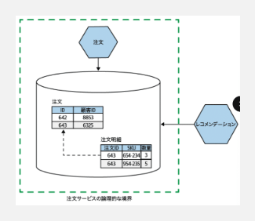
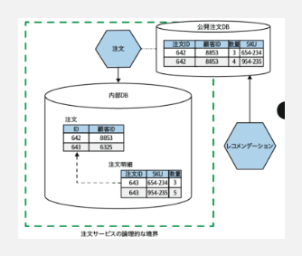
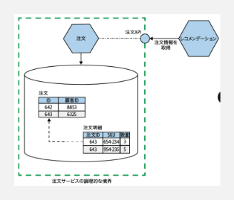
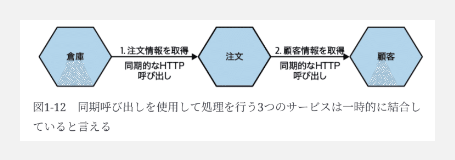

### マイクロサービスとは何か

**What**

* 独立デプロイ可能性。独立してデプロイ可能であるアーキテクチャ（あるマイクロサービスの変更を他サービスに影響なくデプロイ可能）
* 技術の凝集度（フロント、バック、DB）ではなく、ビジネスの凝集度が高く、カプセル化されたビジネス機能を1つ以上のネットワークエンドポイントを介して公開するもの

> データはサービスの内側にカプセル化され、サービスは何を隠して何を共有するか決める能力を手にする

**Why**

* 技術を組み合わせれる
* 各サービスの作業を並行して行える
* ビジネスの凝集度が高いと、担当のビジネス領域の理解がしやすくなる
* 変更範囲が狭くなるので、デプロイ時のリスクが低減

**マイクロサービスの問題**

* ネットワーク越しのコンピュータ通信
    * レイテンシ
    * ネットワーク障害
    * 単一のモノリスでは簡単なトランザクションが困難に

> マイクロサービス専門家のJames Lewisは、「マイクロサービスは選択肢を買い与える」
> つまり、マイクロサービスにはコストがあり、そのコストが手にしたい選択肢に似合うものかを判断しなければならない

**サイズについて**

* 気にする必要なしで、以下2点を気にする
    * どれくらいの数のマイクロサービスを扱えるか？
    * 境界をどう定義すれば、ぐちゃぐちゃに結びつくことなく最大限価値出せるか？

---

### 結合度について

1. 実装結合
2. 一時的結合
3. デプロイ時結合
4. ドメイン結合

**実装結合**

* Bの実装を変更するときに、Aの変更をする必要がある状態
* 一般的なな例として、DBを共有している
* おすすめは実装詳細の隠蔽

> アウトサイドイン思考：コンシューマの視点からサービスのインタフェースを導き出す（しかし残念ながら、多くはデータモデルや別の内部実装の詳細を理解してから外部に公開することを考える）

**一時的結合**

* 全体の処理を完了するために、全てのサービスが起動し連携している状態（同期的な呼び出し）

1. 倉庫システムが、「発送する注文がないか」問い合わせ
2. 注文システムが、「この注文は誰の注文か」を問い合わせ

> 図の例はプル型のイメージが使用されている。プッシュ型（注文されたら倉庫に知らせる）よりリアルタイム性が低い

* キャッシュの使用等で回避（今回の例でいくと、顧客情報をキャッシュ）

1. 注文システムが、必要な顧客情報をキャッシュに保存しておく
2. 倉庫システムからの問い合わせに対して、キャッシュから回答する

* 非同期トランスポートで回避

1. 注文システムが、注文時に注文内容と顧客情報をセットにメッセージブローカーに投げ込み
2. 倉庫システムがメッセージブローカーをタイミングで拾って処理

> メッセージブローカーを用いることで以下の利点あり。
> 1. メッセージ送信後に注文システムがダウンした場合、伝言板（ブローカー）にデータが残っている限り、倉庫システムは止まることなく処理を続けられる。
> 2. 倉庫システムがダウンしていても、注文システムは伝言板にメッセージを置くだけでいいので、注文受付（ビジネス）を止める必要がない。倉庫が復旧した時に、溜まった分を処理すれば良いだけ。

**デプロイ時結合**

* すべてを一緒にデプロイしなければならないもの

> デプロイはリスクを伴う。リスクを減らす方法の1つに、変更する必要があるものだけをデプロイする。

**ドメイン結合**

* 集約と境界づけられたコンテキストがサービス境界として機能する。始めたては、サービス数を減らしたいはずなので、恐らくは境界づけられたコンテキストを対象とする。
    * 集約
        * 1つのマイクロサービスが1つ以上の集約のライフサイクルとデータの保存を処理する
        * 他サービスの機能が、集約の状態を変更したい場合は、その集約内での変更を直接要求するか、集約自体がシステム内の他のものに反応して状態遷移を開始させる必要がある
        * 状態遷移を外部から要求された場合、集約はノーと言うことができる
    * 境界づけられたコンテキスト
        * 集約よりも大きな単位の境界（1つ以上の集約が含まれる）
        * 実装の詳細を隠蔽し、内的な関心事を持つ（例えば、倉庫は注文管理や、在庫配送や、運搬用のフォークリフトの管理を持っている。フォークリフトの種類は倉庫にいる人以外は関心なく、隠されるべき）

---

### モノリスについて

**1. 単一プロセスのモノリス**

* すべてのコードが単一のプロセスに詰め込まれている（本書の対象）

**2. モジュラーモノリス**

* 別々のモジュールで作成されており、デプロイのために結合する必要があるシステム
* モジュールの境界が明確に定義されていればいい選択（Shopifyが例）
* 課題は、コードでみられる分解がDBで失われる

> 論理的には分割されていて、物理的には分割されていない状態

**3. 分散モノリス**

* 複数サービスで構成されているものの、何らかの理由でシステム全体が一緒にデプロイされなければならなくなっているシステム
* 情報隠蔽やビジネス機能の凝集に十分な焦点が当てられていない環境で発生しがち

> 単一プロセスとの違いは、 1カ所変えたら他サービスもデプロイしなければならない状態。単一プロセスは全体（1つ）をデプロイ。

**4. サードパーティ製のブラックボックスシステム**

* 自分たちでコードを変更できないもの

**課題**

* 同じ場所で作業する人が増えて邪魔
* 意思決定の難しさ

**利点**

* 技術の凝集度を高めることができるので、コードの再利用等

> 「モノリス＝レガシー」ではない。モノリシックアーキテクチャは選択肢の1つ。