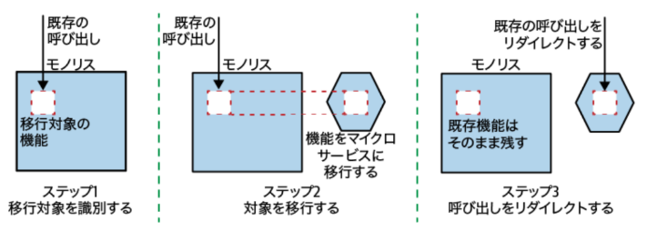
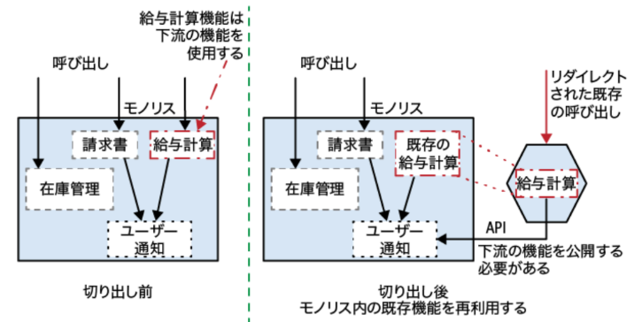
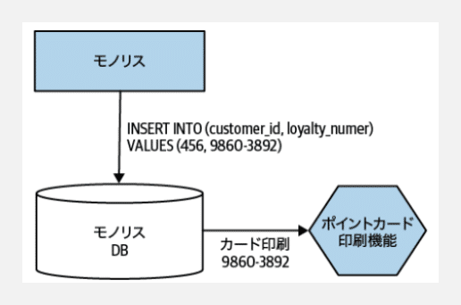
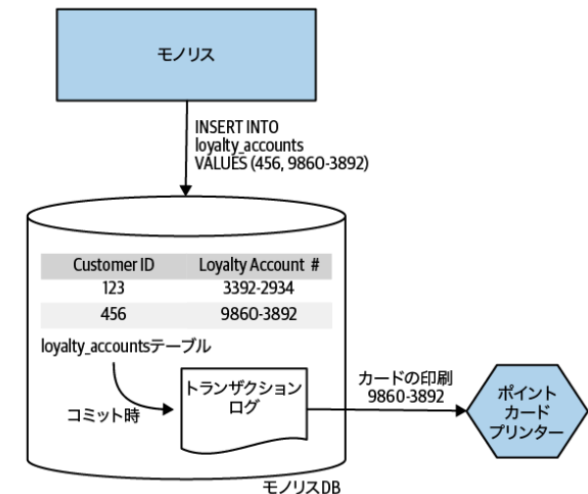

### マイクロサービス以外の手段

* 既存モノリスのコードが十分に整理されているならコピー。その場合も機能を一定期間モノリスに残しておくことでリスク回避
* モジュラーモノリス
* 段階的なリライト

### 3.3 ストラングラーアプリケーション

一言でいうと：「行き先を振り分ける（すり替える）」パターンです。 古いモノリスとユーザーの間にプロキシ（転送役）を置き、特定の機能への呼び出しを新しいマイクロサービスへ横取りして流します。 動き: ユーザーが「お会計（会計機能）」に来たら、プロキシが「あ、その機能はあっちの新しい窓口（マイクロサービス）に行ってください」と誘導します。 特徴: 最終的には古い機能を「枯らせて（Strangle）」、新しいサービスだけに置き換えるのが目的です。 限界: 「入り口（HTTPなどの通信プロトコル）」で待ち伏せできないと使えません。 

入口で待ち伏せとは？：HTTPリクエストの内容に応じて、リダイレクト

動作: リクエストを「横取り」して、新しいサービスへ「リダイレクト（転送）」します 。

イメージ: 「お会計」のURLに来た人は新しいレジへ、「在庫確認」のURLに来た人は古いレジへ、と完全に分断して案内します 。

目的: 徐々に古い機能への道を塞いでいき、最終的にモノリスを空っぽにして引退させることです 。


**ポイント**
* 新システムを本番環境にデプロイしても呼び出しが新しい機能にリダイレクトされるまでは有効ではない
* 新システムができたときに、意図通り動作しているかを確かめるのに同時進行パターンを使用できる
* 簡単にロールバック可能




**給与計算ビジネスロジックの切り出しの例**

* 後工程であるモノリス側の通知機能を外側に公開（更新系）し、外から叩けるようにしなきゃいけない




> 次期ai21の場合、「指図」がないのでややこしくなる。
> 1. 次期ai21で受注が完了する
> 2. 現行ai21の「登録指図API」が公開されており、そのAPIを次期ai21の受注機能が叩く（※「登録指図API」＝「受注API」となっているので、結果的に受注結果を書き込むだけのAPIとなる）

> つまり、結果的に「受注」を切り出すためには、受注結果の書き戻しAPIが必要（＝登録指示API）
> 基本的な考え方として、依存している後工程の指示APIがあることで、そのビジネスを切り出せる

---

### 3.8 デコレーティングコラボレーター

デコレーター

一言でいうと：「ついでに別の仕事も頼む（付け加える）」パターンです。 モノリスの機能はそのまま動かしつつ、その呼び出しの「前後」でこっそり新しいサービスを呼び出します。 動き: ユーザーが「注文（モノリス）」をします。プロキシはそれをそのままモノリスに通しますが、注文が成功したのを見届けると、「ついでにポイントも付与しておいてね（ポイントサービス）」と別のサービスに連絡します。 特徴: モノリスの既存の挙動を変えずに、新しい機能（デコレーション＝飾り）を追加できます。 限界: プロキシが「注文が成功した」という情報や、「誰がいくら買ったか」という詳細情報を通信内容から読み取れないと動けません。 

ストラングラーパターンとの違い：リクエスト自体はモノリスに流す。処理結果（レスポンス）から、こっそり別のマイクロサービスを呼び出す。

イメージ: 「注文」のリクエストを古いレジに通してあげつつ、注文が成功したのを横目で確認して、裏で「ポイント付与サービス」にこっそり電話をかけるような状態です 。

目的: モノリス側には一切手を加えずに、新しい付加価値（機能）を追加することです 。

※現行にもあるサービスをこっそり呼び出す場合、同時進行パターンに近しい

---

### 変更データキャプチャ

* 実装に課題があるため、最小限に仕様を抑える
* 潜在的な課題を理解していれば、モノリス内のデータの変化に反応する必要があり、コードベースも変更することができない場面で使える

**1. データベーストリガー**

* モノリスへのデータ挿入を検出して、サービス呼び出し
* トリガーはDBにより異なる。図では```INSERT```でマイクロサービスを呼び出す例。
* 課題として、トリガーが増えるほどシステムがどのように動作するのか理解するのが難しくなるので使用は控えめに



> 顧客登録の```INSERT```をトリガーに、ポイント印刷機能を呼び出し


**2. トランザクションログトリガー**

* トランザクションログ：差分のみ表示される
* ほとんどのRDBにトランザクションログという変更の全記録が書き込まれたファイルが存在する
* DBの外から起動するので、結合や競合に関する懸念が少なくなる
* ソリューションに大きな複雑さが加わる可能性




**3. バッチ差分コピー**

* 最も単純なアプローチ
* 問題として、差分を調べる部分。行レベルで情報を得たいのに、テーブルレベルでしか変更タイムスタンプが得られなかったり

**使いどころ**

* モノリス内のデータの変化に反応する必要があるものの、システムの境界でストラングラーやデコレーターを使えず、かつモノリスのコードを変更できない場面

> * ストラングラーやデコレーターを使えない場合
>   * どちらもプロキシ（HTTPリクエストの転送）によるパターン。コードが奥深いなど外から見えない内部処理の場合、タイミングが使えない
>   * プロキシが通信を傍受しても、そのデータの中に「どの顧客が注文したか」というIDが含まれていなければ、ポイントサービスは誰にポイントを付けていいか分からない
> * モノリスがブラックボックス化や、SaaSを使用している場合、コードを変更できない