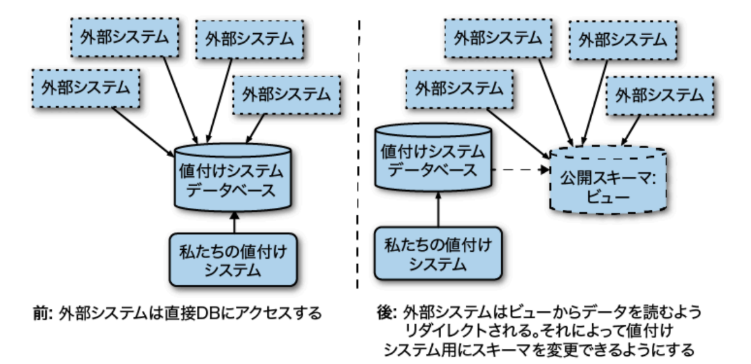
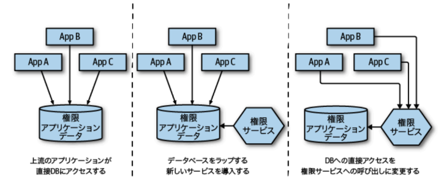
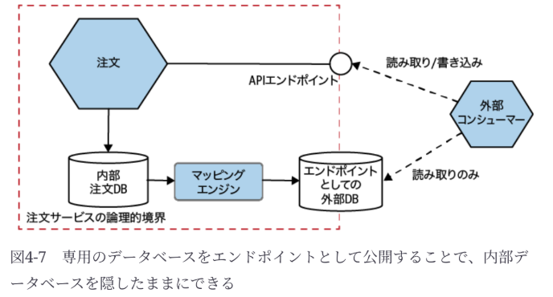
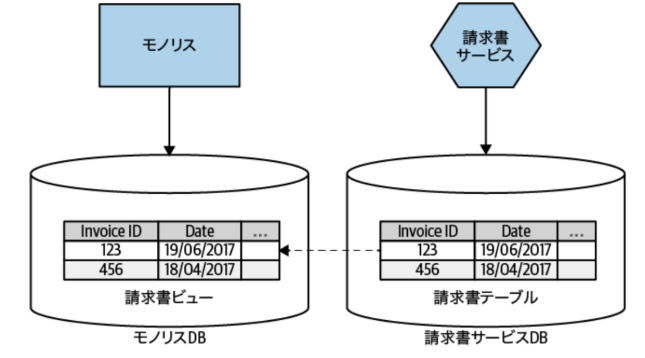
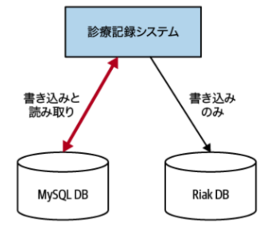
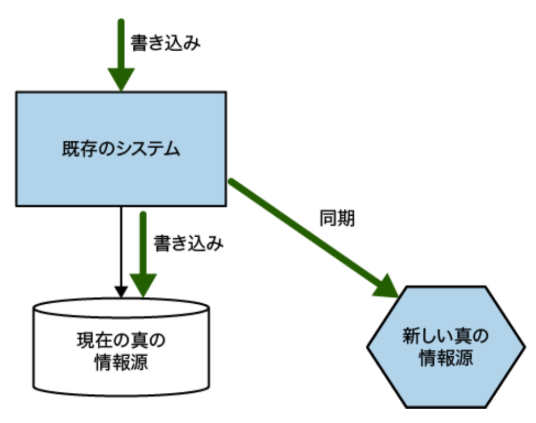
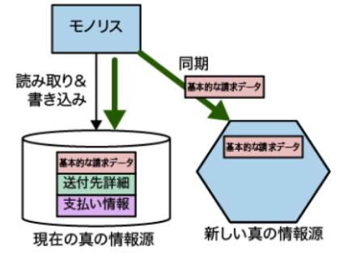

### 共有データベース
**課題**

* 情報隠蔽に反する。どの部分を安全に変更できるかを理解するのが難しくなる
* データの管理者が不明瞭になる
* ビジネスロジックの凝集度が欠如する。ビジネスロジックを変更する振る舞いがシステム全体に散らばる

**解決策**

* 解決策としては、「データベースビュー」か、「データベースをラップするサービス」

**共有データベースの使いどころ**

1. 読み取り専用に静的参照データを考える場合
* 国の通貨コード情報や郵便番号の参照テーブル。
> 次期ai21でいけば、メーカーから与えられるマスターデータや、全国販売店共通の参照データ。

2. 複数のサービスが同じDBに直接アクセスするのが適切な状況
* 「サービスのインタフェースとしてのデータベース」

---

### データベースビュー

**What**

* 外部システム向け公開用のDB
* あくまでも既存DB上に作成するもの

> 車の販売領域の場合、注文テーブルに、注文情報だけでなく下取車の情報や登録情報が混在しており、さらにシステム内部構造データが含まれている。ビューは、注文テーブルから注文情報だけを提供するようなクエリにより、情報隠蔽を実現している。

**How**

* RDBで一般的な機能
* クエリの結果から生成

**When**

* 既存のモノリシックを分解することが現実的ではないとき
* データ構造やデータ型はモノリスに引っ張られるので、最終目的がマイクロサービス化であるならば、できればビューの仕様を避けた方がいい

---

### データベースをラップするサービス

* ①現行そのままのデータをラップするように新サービスを構築する。
* ②新サービスへアクセスを移動させる

> ※モノリスへのアクセスがなくなったら、初めてスリム化等は検討していくイメージ

---

### サービスのインタフェースとしてのデータベース

**What**

* マッピングエンジンで、現行の変更を完全に無視したり、変更を公開したり、その中間のようなことを行える

**How**

* 変更データキャプチャ
* バッチ処理によるデータコピー

---

### 所有権を移す
* データベースビュー、データベースをラップするサービス、サービスのインタフェースとしてのデータベースは巨大データベースに包帯を巻いただけ
* データを取り出す前に、データはどこにあるべきかを考える必要がある

**新しい請求書サービスには従業員の情報が必要**

* 従業員API/イベントストリームの公開により、集約の現在の状態の参照と、集約の状態遷移の要求を外部に公開
* 公開により、新しい従業員サービスに対するコンシューマのニーズ理解の効果も

**モノリスの請求書テーブルは、新しく抽出した請求書サービスによって管理されるべきデータ**

* 請求書関連のデータをモノリスから新しい請求書サービスに移す
* 次に、モノリスを変更し、請求書サービスを真の情報源として扱う
> 次期ai21では、モノリスの改修ができないので、書き戻しで対策（ではいつ撤廃できる？）

---

### 現新データ同期

* 過渡期はデータベースビューのように、新請求書サービスがモノリスからデータを直接読み取る
* 切り替え成功したことを確認したら、所有権を新に移す

---

### アプリケーションでのデータ同期

1. データをバッチ移行。新しい書き込みは変更データキャプチャの実装等で同期
2. 現行では書き込みと読み取り、新では書き込みのみ
3. 新を真の情報源に。両方のDBに書き込んでいるので問題があればフォールバック

---

### トレーサー書き込み

* アプリケーションでのデータ同期は、データの真の情報源を段階的に移行する
* トレーサー書き込みは2つの真の情報源
> 次期ai21ではこの方式を採用している

