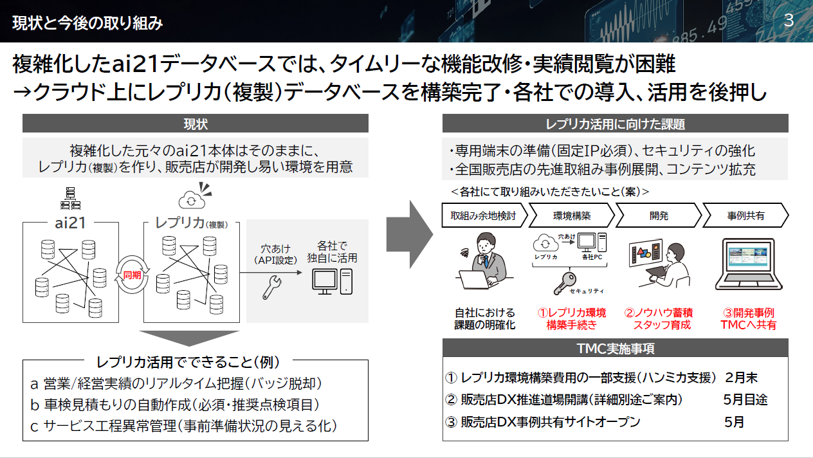
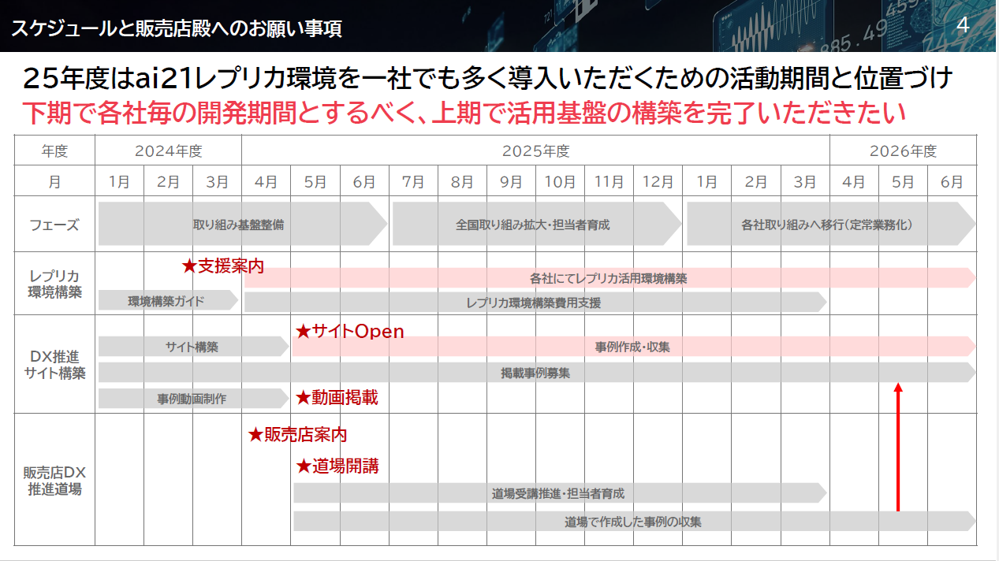

### スズキ Denodo

**現状と課題**

1. 標準マスタの不在。データの整合性の担保
2. 各部署がデータを取り込んで、使う

* データ探索に時間がかかり、課題抽出やソリューション立案に時間がさけない

**変遷**

* 2021年から1年データ統合チャレンジ
* データカタログを作れるという点でDenodoの採用
* ただ、それだけでは価値を生まないので、市民開発サポートやAIチャットボットにチャレンジして飛躍的に伸びた
    * 社内HPやメール配信の展開は手ごたえ無し
    * その背景として、機密情報や個人情報など、全社公開できるデータ少ない
* 挿入してからの良さとして、物理的なDB,テーブル、ETLを作らない

> ETLを作らなくていいとはどういうこと？

**解決策**

* データを使える人を増やしてから、データ量を増やすことで活用が推進
* カタログ作成から市民開発の推進へ

**1. 市民開発の推進**

* 活用事例の公開、問い合わせサポート
* 開発サポートやハンズオン、開発事例展示会

> トヨタにおける販売店道場の取り組み。日本事業本部にアプローチをかける選択肢も最近挙がってきているので、富士通主体でワークショップ提案することで接点づくり＆提案できないか？





**2. AIチャットボット**

* 今はAI使うのが当たり前（道半ば）

---

### LION AI Readyなデータ基盤

**セマンティックレイヤ**

* 自然言語で回答できるような、セマンティックレイヤーの構築

**AI活用**

* データをRAGのインプット（検索対象）だけでなく、モデル自体の学習データとして活用

1. ファインチューニング
* 特定のデータセットを使って追加学習を行い、特定のタスクや知識に特化させる。

2. 継続事前学習 (Continued Pre-training)
* 膨大な専門文書などを読み込ませ、モデルが持つ基礎知識そのものをアップデートする。

**モデルに取り込む方法**

* OpenAIやGoogleなどが提供するプラットフォームにデータをアップロードして、ボタン一つ、あるいは数行のコードで実行する方法がある。

1. データ準備: 質問と回答のペアを大量に作成し、指定の形式（JSONL形式など）に整える。
2. アップロード: サービス（OpenAIのFine-tuning APIなど）にファイルを送る。
3. 学習実行: クラウド上で学習が開始される（数時間〜数日）。
4. 利用: 学習完了後、自分専用の新しい「モデルID」が発行され、それを使って推論を行う。

```
{"messages": [{"role": "system", "content": "あなたは弊社の専門カスタマーサポートです。"}, {"role": "user", "content": "製品Aの保証期間は？"}, {"role": "assistant", "content": "製品Aの保証期間は、ご購入日から2年間です。"}]}
{"messages": [{"role": "system", "content": "あなたは弊社の専門カスタマーサポートです。"}, {"role": "user", "content": "返品の手続きを教えて。"}, {"role": "assistant", "content": "返品は、未開封に限り到着後8日以内にマイページから申請可能です。"}]}
```

---

### JSOL MDM

**MDMのモデル**

1. 集権型（集中管理型）

* マスタを一元管理できる
* 業務プロセスの変更が必要

2. 集約型（名寄せ型、コンソリデーション型）

* 低コスト
* 既存業務の影響が小さい

3. ハイブリッド型（HUB型）

* いいところどりだが、設計/運用は複雑になる

> 基幹システムの場合、集約で1つにしたあとに集権で周辺システムに配るとかしていた

**各マスタの課題/目的から適切なモデルを選択**

1. スコープ選定、MDMに求める機能の整理
2. 各マスタの課題、MDMモデルの選択
3. スモールスタート
4. 領域拡大

**どういうマスタが、それぞれどのモデルに適しているのか？**

* 集権型（集中管理型 / Registry-Centralized）
    * 品目マスタ（製品コードなど）: 全社で共通のコードを使わないと、在庫管理や生産計画が破綻するようなデータ。
    * 勘定科目マスタ: 財務会計において、グループ全体で厳格な一致が求められるデータ。

> 柔軟性が低いが、高い品質が必要なデータ
> 車業界の例として、車両情報。車種名、グレード、主要諸元は全社共通であるべき。ここがズレると、カタログやWeb予約、下取り査定に致命的な不整合が出る。販社間の在庫管理の最適化による回転率向上などに寄与。


* 集約型（名寄せ型・コンソリデーション型 / Consolidation）
    * 顧客マスタ: BtoB取引などで、拠点ごとに異なるCRMを使っているが、全体での取引額を把握したい場合。
    * 仕入先（サプライヤー）マスタ: 購買部門がバラバラで、同じ会社からバラバラの名称で買っている場合。

> 柔軟性が高いが、管理が弱い
> 車業界の例として、顧客データ。各販社に散らばった顧客データをMDMで集約（名寄せ）することで、「A販社で新車を買い、B販社で点検し、C販社で買い替える」という行動が捕捉可能に。各販社でCRMが分かれている場合、まずは「名寄せ」を行い、同一人物が他店で何を買ったかを可視化することから始める。


+ ハイブリッド型（共存型・HUB型 / Hybrid）
    * グローバル展開している品目マスタ: 「品番や基本仕様」は本社管理だが、「現地価格やリードタイム」は各国の拠点に任せたい場合。
    * 従業員マスタ: 「社員番号」は全社共通だが、「現地の社会保険情報」などは各国の法規制に合わせて個別管理したい場合。

> 車業界の例として、オプション・用品マスタ。本体提供の標準用品に加え、各販社独自のコーティングやローカルオプション（寒冷地仕様など）を付加するため、共通枠と自由枠の共存が必要です。


---


### 生成AI MDM 水谷さん

**生成AIとRAG**

* インターネット　⇒　コーパス　⇒　LLM　⇒　生成AI
* 業務ユーザが扱うのは、生成AIの右側。十分活用するために、RAGでユーザ知識を取り込む

**MDM**

1. レコード単位のマネジメント
2. メタデータのマネジメント
    * システムの乗り換えのたびにマスタ調査が必要
    * 「なぜそうなったか」のコンテキストがない

* 「どういうマスタになりたいか」ではなく、「どういうマスタになるべきだったか」
* マスタは業務であり知識


---

### 生成AI データブリックス・ジャパン

* 「生データ（データレイク）　⇒　DWH」のような2層アーキテクチャによる弊害
    1. データの鮮度（AIが昨日のデータで判断できない）
    2. 膨大なETLコスト
    3. ガバナンスの欠如

**データカタログ**

* テーブルの説明は、生成AIが自動的に作ってくれたもの

> As-IsからTo-Beの初期モデル構築を生成AIで出来ないか？As-Isのデータの説明から、説明・品質の注意等のメタデータに振り分けることや、今作成しているコンフルの整形方針から自動的に整形するイメージ
> * TMルールのマークダウン（パワポから自動作成、もしくは松本さんにもらう）
> * 整形方針のマークダウン（今作成しているコンフル）
> * As-Isデータモデル（Marmaidや独自記法）
> * 指示コンテキスト（To-Beメタデータの作成方法。しがらみを1つずつ解消していく旨）
> * 実例コンテキスト（組織やお客様など、今までの事例。Marmaidや独自記法。）